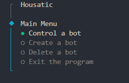
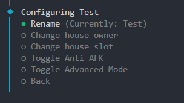
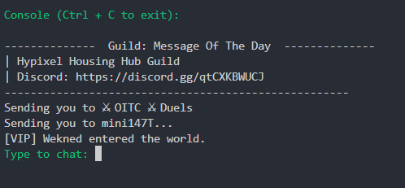

 
  
# Housatic (CLI)

A user-friendly bot manager for **Hypixel Housing**.

## About

Housatic is a piece of software that helps manage bots in Hypixel Housing. Bots are an incredibly useful way to broaden the limits of the Housing ecosystem, allowing for more complex automated capabilities like block manipulation, data storage, advanced arithmatic, and more. Join our [Discord](https://discord.gg/FZV67qvSy6) to stay up to date and recieve help.

This is the CLI version, intended for running the app through command line. For the GUI version, see (Coming Soon).

Images

## Getting started

To get started with Housatic, head over to [our Wiki](https://github.com/Wekendd/housatic-cli/wiki), where we detail install instructions, scripting basics, etc.

## Building & running locally

1. Install [Node.js](https://nodejs.org/en)
2. Clone this repo to your local machine
3. In your local repo directory, run `npm install` to install dependencies
4. Run `node .` to start the app
